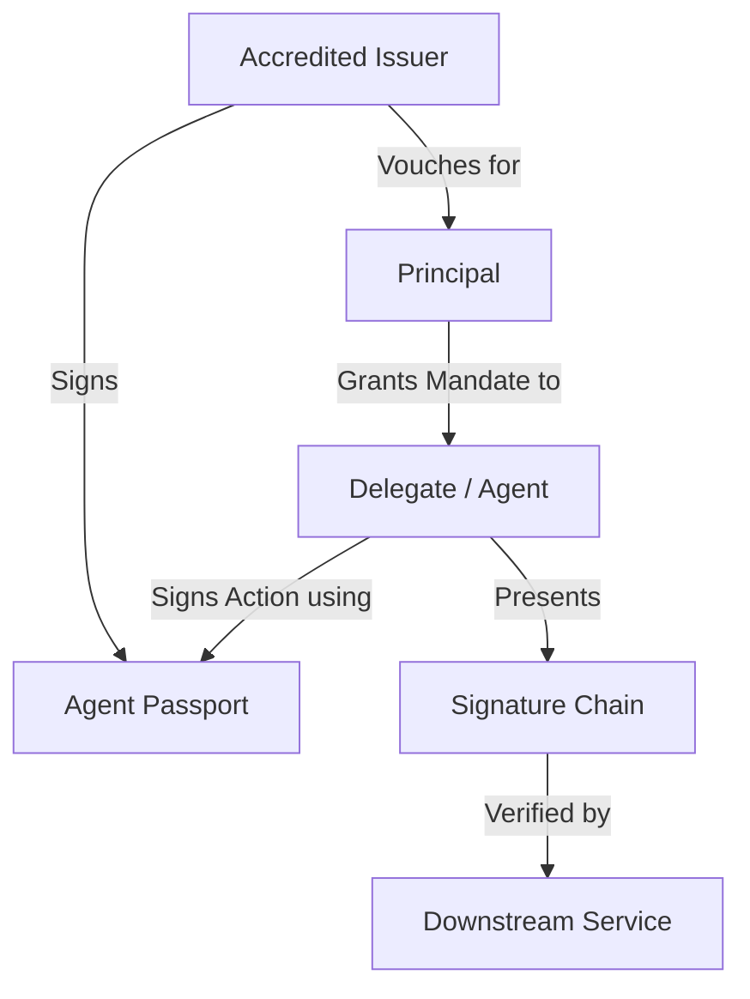

## Introduction

The Passport Alliance defines an open standard for AI agent identity, authorization, and accountability. This overview explains the core domain model and how the different components of the specification work together.

## Domain Model

The Passport model is built on four core entities:

1.  **Principal**: The legal entity (Human or Organization) that owns the agent and is legally accountable for its actions.
2.  **Delegate**: The AI Agent itself, which acts on behalf of a Principal.
3.  **Mandate**: A scoped, time-bound authorization granted by a Principal to a Delegate (e.g., `email.send`).
4.  **Agent Passport**: The cryptographically-bound identity of the Delegate, issued by an accredited Issuer.

### Architecture Diagram

## Three-Party Signature Chain

The core of the Passport trust model is the **Three-Party Signature Chain**. Every action taken by an agent is cryptographically linked back to the principal who authorized it and the issuer who vouched for the agent's identity.

1.  **Issuer Signature**: Proves the passport is authentic and the issuer is accredited.
2.  **Principal Signature**: Proves the agent was authorized via a specific mandate.
3.  **Delegate Signature**: Proves the agent itself performed the action.

## Core Specification Sections

Dive deeper into the technical details:

- [**Agent Passport Credential**](/spec/agent-passport): The structure of the DIDs and the passport payload.
- [**Three-Party Signatures**](/spec/signatures): Cryptographic algorithms and verification logic.
- [**Mandates & Scoping**](/spec/mandates): How to define and enforce agent permissions.
- [**Federation & Trust**](/spec/federation): Cross-issuer discovery and revocation.
- [**DID Method**](/spec/did-method): The `did:passport:` method specification.
